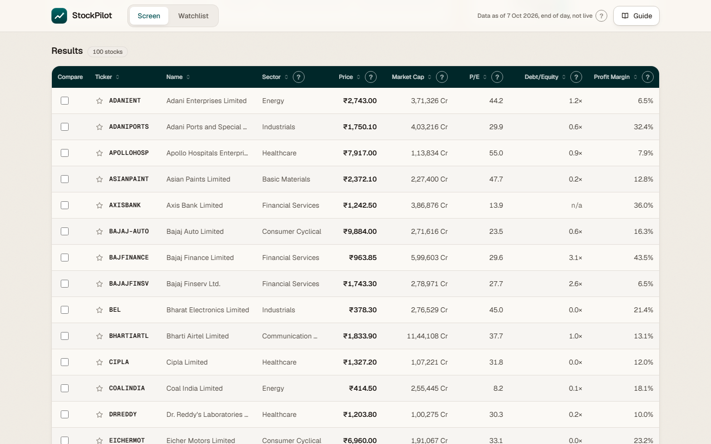
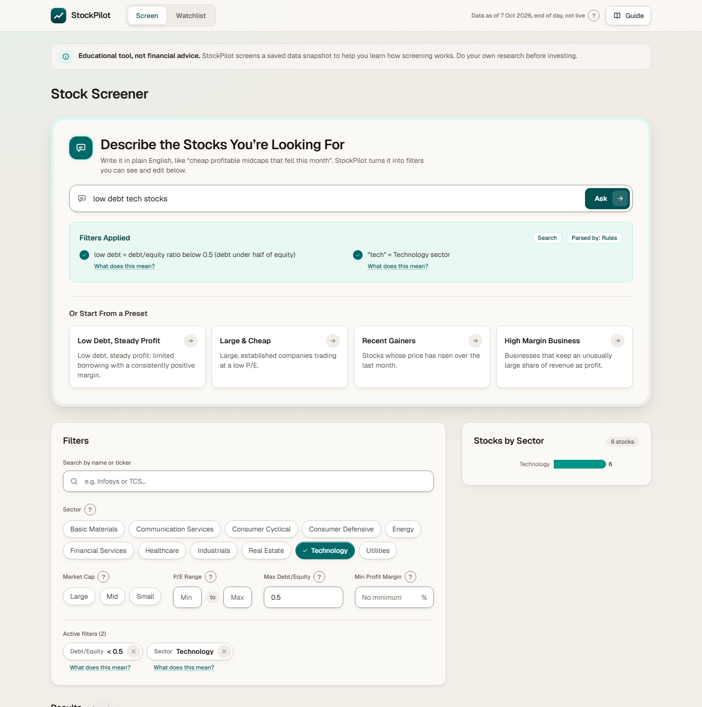
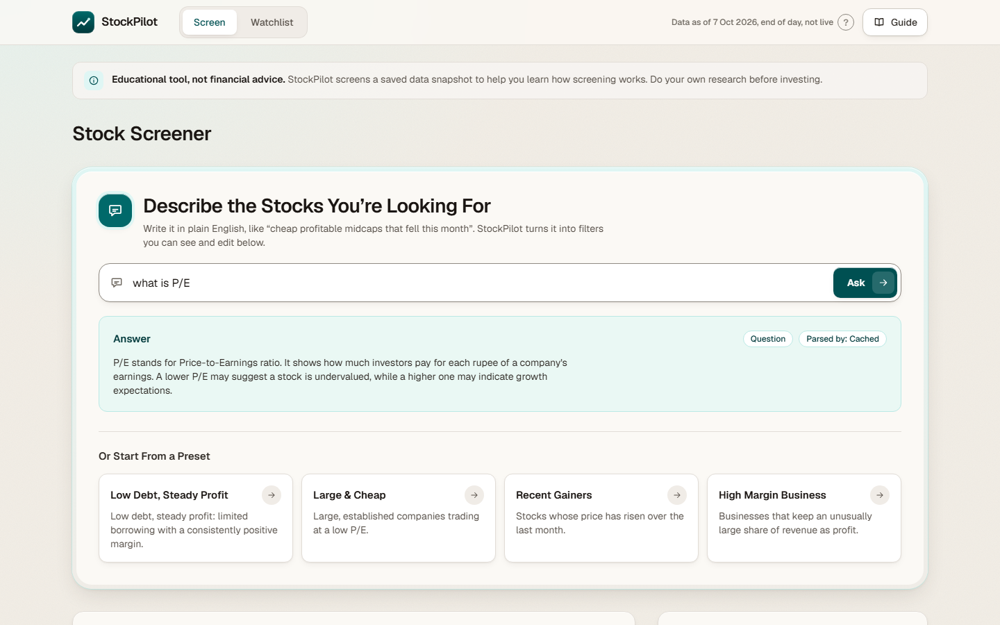
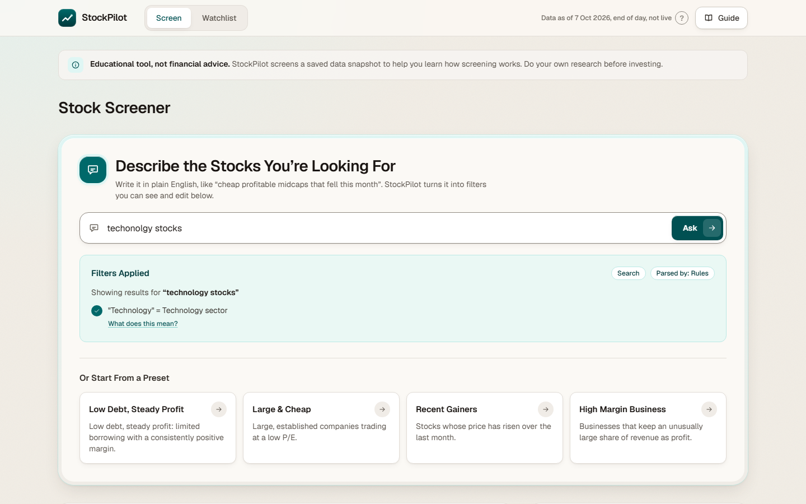
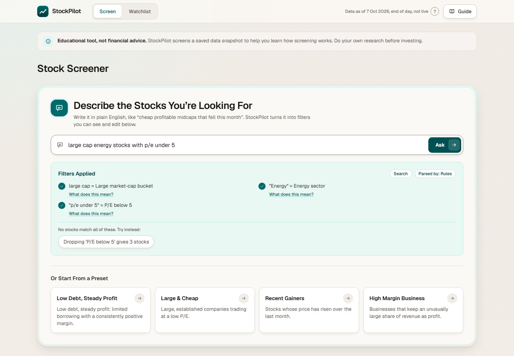
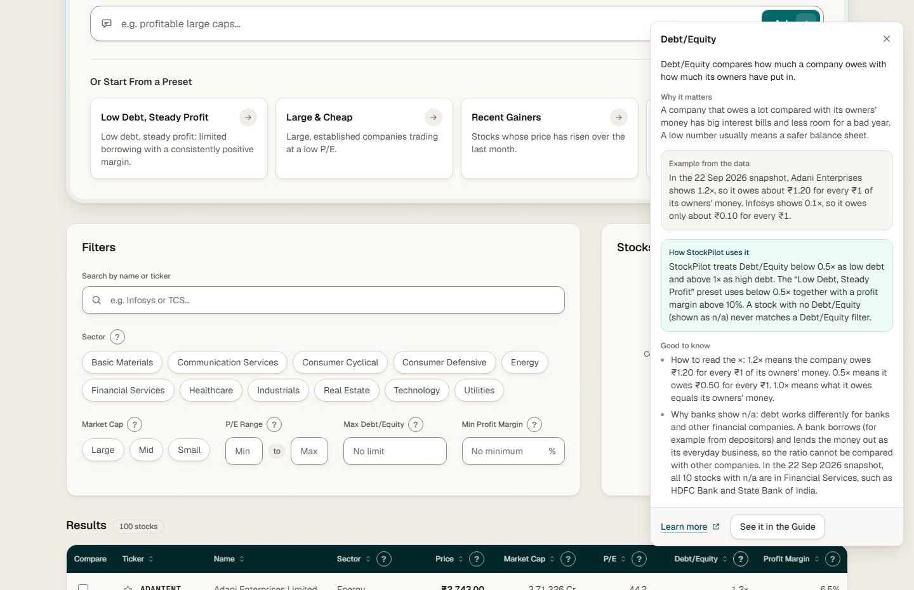
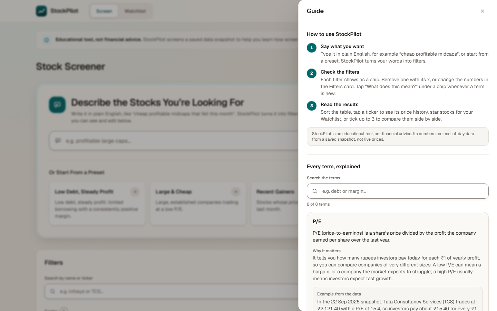
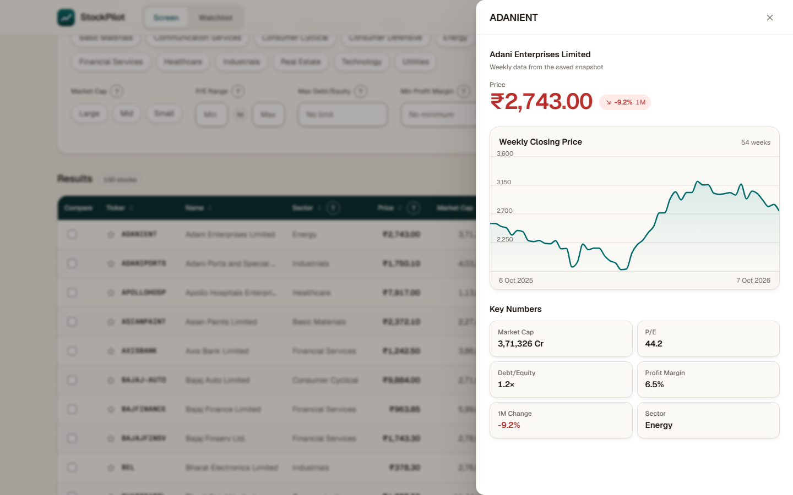
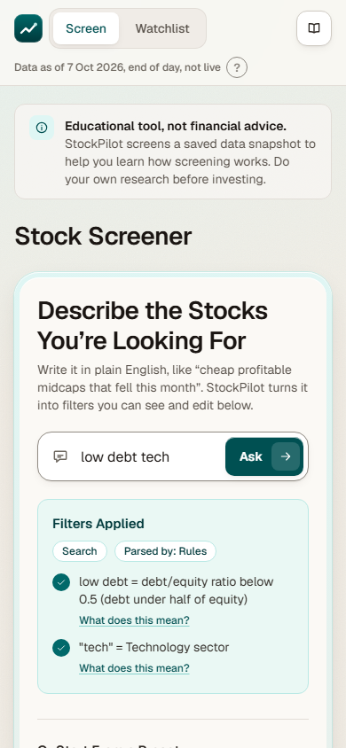

# StockPilot

A beginner-friendly stock screener for about 100 Indian stocks, with plain-English search, a built-in glossary and an AI helper. A final-year CSE project at Chitkara University. Educational use only, not financial advice.

## Live demo

**[https://stockpilot-hw7d.onrender.com/](https://stockpilot-hw7d.onrender.com/)**

The app runs on free hosting that sleeps after inactivity, so the first load can take about a minute. A short "waking up" notice appears while the server starts.

## Screenshots

| | |
| --- | --- |
|  |  |
| **Screener.** Sortable table of all 100 stocks, with the end-of-day date in the header. | **Plain-English filters.** A search becomes visible notes and removable filter chips. |
|  |  |
| **AI answer.** Questions get a short plain-text answer (this one was served from the answer cache). | **Typo tolerance.** The corrected query is shown above the filters it produced. |
|  |  |
| **Zero-result help.** When nothing matches, one-click suggestions show which filter to drop. | **Glossary popover.** The "?" next to every metric explains it with a worked example. |
|  |  |
| **Guide.** A three-step how-to plus every term explained. | **Stock detail.** Weekly closing price chart and key numbers. |



**Mobile.** The layout adapts to phone width; the table becomes stacked cards.

## What it does

- Screens about 100 stocks (NIFTY 50 + NIFTY NEXT 50) by sector, market-cap bucket, P/E, Debt/Equity, profit margin and 1-month price change. Sort, paginate, star a watchlist, and compare up to 3 stocks side by side.
- Plain-English filters: type "cheap profitable midcaps that fell this month" and see it turned into filters you can read and edit.
- A beginner glossary (a "?" next to every metric) and a Guide drawer that explains each term with a worked example.
- Typo-tolerant search ("techonolgy" still works) with an AI helper for questions such as "what is P/E".
- Zero-result help: when no stock matches, StockPilot suggests which filter to drop and how many stocks that gives.

## How the data works

- **End of day, never real-time.** Prices and ratios come from Yahoo Finance through the unofficial [`yahoo-finance2`](https://www.npmjs.com/package/yahoo-finance2) package, which uses undocumented endpoints and is not a licensed data feed. The app header always shows the "Data as of" date.
- **Daily refresh.** A GitHub Actions job (`.github/workflows/ingest.yml`) runs on weekdays at 12:30 UTC, fetches every ticker and upserts it into MongoDB Atlas. A failed ticker keeps its previous data, and the "as of" date only advances if at most 10% of tickers failed.
- **Fallback.** If MongoDB is unreachable, empty or not configured, the server reads the committed snapshot `data/stocks.json` instead. `DEMO_MODE=true` skips MongoDB entirely and uses the snapshot only.
- **Stock universe.** The ticker list is hand-maintained in `server/src/data/tickers.ts` and is not updated automatically when the indices change.
- **Debt/Equity.** Shown as a ratio such as 1.2x (about Rs 1.20 of debt for every Rs 1 of owners' money). Yahoo reports it as a percentage, so we divide by 100. Banks and other financial companies show n/a because the ratio does not mean the same thing for them.

## Architecture

```
GitHub Actions (weekdays, 12:30 UTC)
        |  fetch from Yahoo Finance, upsert
        v
MongoDB Atlas  --(fallback: data/stocks.json)-->  Render web service
                                                  Express: /api/* + built React app
                                                          |
                                                          v
                                                       Browser
```

- `server/src/data`: the only place that knows where stock data lives (`loadStocks`).
- `server/src/engine`: pure filter, sort, search and paginate functions behind `POST /api/screen`.
- `server/src/nl`: typo fixing, the rule parser, the LLM client and zero-result help behind `POST /api/parse`.
- `web/src`: the React app; `web/src/api/client.ts` is the only file that calls `fetch`.

**Stack:** TypeScript, React, Vite, Tailwind CSS, Recharts, Express, zod, MongoDB (official driver), Vitest. Hosted on Render, data refreshed by GitHub Actions.

## The AI helper

- **Provider.** A hosted NVIDIA model, configured through `LLM_PROVIDER=nvidia`. Gemini is also supported by setting `LLM_PROVIDER=gemini`; the server uses whichever one is configured and does not switch between them on its own.
- **What it does.** It turns a search into filters, or answers a short question such as "what is P/E".
- **What it does not do.** It never sees stock data, only the text you type and the list of allowed filter fields. Its output is validated with zod and discarded if it does not fit. It gives no investment advice: advice-style questions get a fixed educational reply.
- **Safeguards.** Calls are rate limited per visitor and capped per day, answers are cached, and every failure (timeout, quota, invalid reply) falls back to the offline keyword parser, so search always works. When the helper is unavailable the app says "AI helper is resting, showing keyword matching only."

## Run locally

Requires Node.js 22 and npm. The repo has three `package.json` files (root, `web/`, `server/`), each installed separately.

```bash
git clone https://github.com/AlfredBateman/StockPilot.git
cd StockPilot
npm install
npm install --prefix web
npm install --prefix server
cp .env.example server/.env   # the server reads server/.env
npm run dev                   # API on :3001, web on :5173
```

Environment variable names (all optional; set the values in `server/.env`, never commit them):

| Name | Purpose |
| --- | --- |
| `DEMO_MODE` | `true` runs fully offline: snapshot file only, no MongoDB, no network calls. Safest for a demo. |
| `MONGODB_URI` | MongoDB Atlas connection string. Blank means use `data/stocks.json`. |
| `LLM_PROVIDER`, `LLM_API_KEY`, `LLM_MODEL` | AI helper settings. Any blank means keyword matching only. |
| `LLM_DAILY_CAP` | Most AI calls per UTC day (default 300). |
| `PORT` | Server port (default 3001). |
| `ALLOWED_ORIGIN` | Optional CORS origin for deployments. |

Commands, run from the repo root:

| Command | What it does |
| --- | --- |
| `npm test` | Runs the web and server Vitest suites. |
| `npm run build` | Type-checks and builds both packages. |
| `npm start` | Serves the built API and frontend (what Render runs). |
| `npm run eval` | Scores the search parser on `eval/queries.json` and writes `eval/results.md`. |
| `npm run snapshot` | Re-fetches all tickers from Yahoo into `data/stocks.json`. |
| `npm run ingest`, `npm run seed`, `npm run mongo:status` | Fill and inspect MongoDB (need `MONGODB_URI`). |

## Evaluation

`eval/queries.json` holds 70 hand-written queries, each with an expected result that I wrote myself and have not independently reviewed. In `eval/results.md` the offline rule parser matches 69 of 70 expectations, which mostly shows the parser does what I traced it to do, not real-world accuracy. The AI helper scored lower in that run (34 of 70) mainly because the hosted model was slow: calls hit the 8 second timeout and fell back, which is how the app behaves in practice too.

## Limitations

- Data is end of day, from an unofficial source that Yahoo can change or block at any time.
- Free hosting sleeps after inactivity, so the first visit can take about a minute.
- The AI helper depends on a free-tier model: it can be slow, time out or run out of daily quota, and then the app uses keyword matching only.
- About 100 stocks only, and the list is maintained by hand.
- The keyword parser is a fixed dictionary, not general language understanding. Vague words such as "safe" or "growth" are deliberately unsupported because the data cannot define them.
- Market-cap buckets are my own thresholds calibrated to this 100-stock set, not the official SEBI rule.
- The URL does not store your filters, so a shared link opens the default view.
- Not financial advice.

## Disclaimer

StockPilot is a student project for learning and demonstration. It is not financial advice, nothing in it is a recommendation to buy, sell or hold any security, and the data may be late, incomplete or wrong. Do not use it to make real investment decisions.
