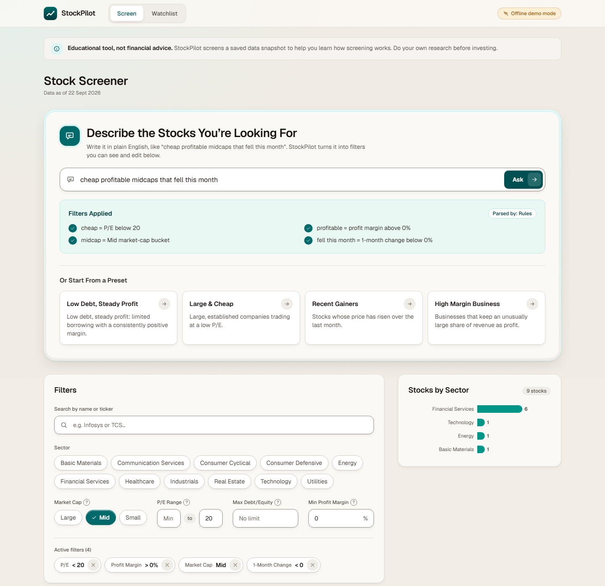
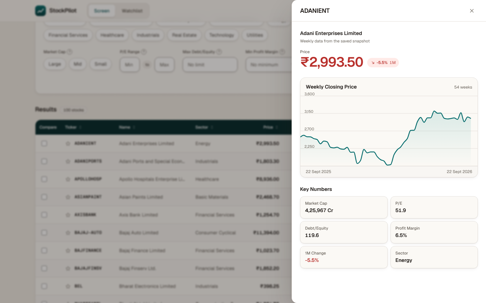
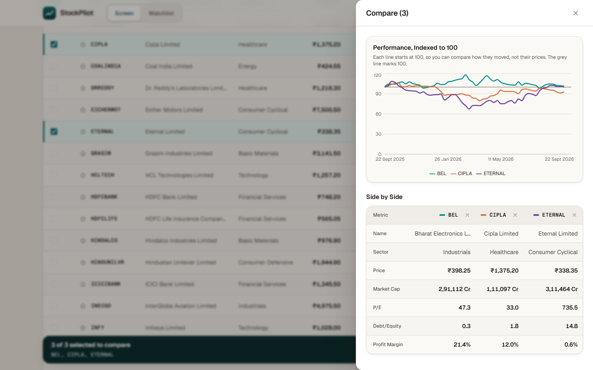
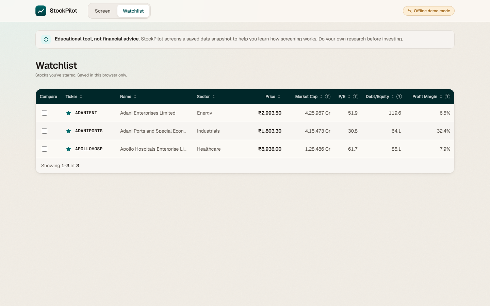
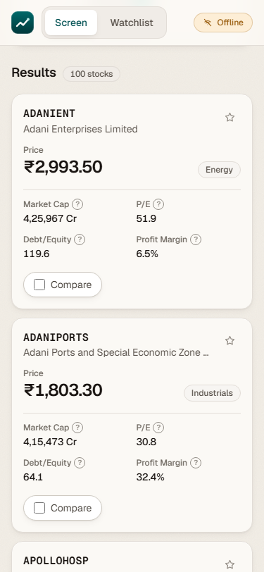
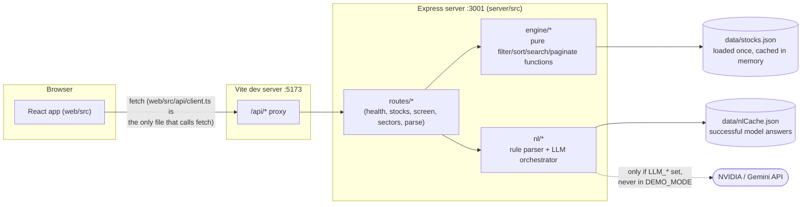
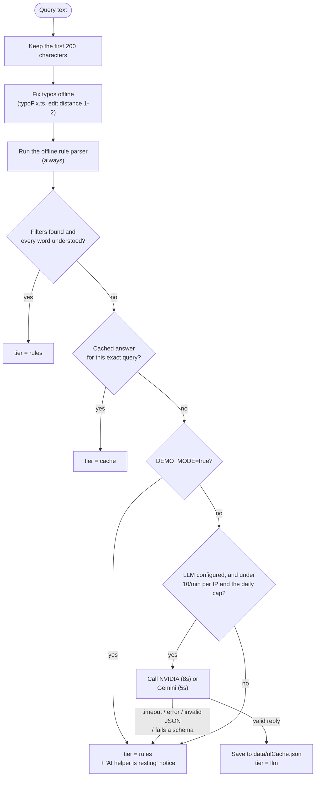

# StockPilot

A final-year CSE project at Chitkara University. Educational use only, not financial advice.

A beginner stock screener for the NIFTY 50 + NIFTY NEXT 50 universe.

## Screenshots


The screener results table, with sortable columns and a compare checkbox and star on each row.



The query "cheap profitable midcaps that fell this month" turned into four filters by the rule parser, shown as notes, a "Parsed by: Rules" badge, and removable chips.



The stock detail drawer for Adani Enterprises: a weekly closing price chart and a grid of key numbers.



The compare drawer for three stocks: a line chart indexed to 100 above a side-by-side metrics table.



The Watchlist page showing three starred stocks.



The screener at phone width, where the table becomes stacked cards.

## What this is

- A screener over a **fixed, in-memory snapshot** of ~100 Indian stocks (`data/stocks.json`): filter by sector, market-cap bucket, P/E, debt/equity, profit margin, and 1-month price change; sort, paginate, search by name/ticker, star a watchlist, and compare up to 3 stocks side by side.
- A free-text query box ("cheap profitable midcaps that fell this month") that turns plain English into the same filter contract, either with a fixed offline rule parser or, if configured, an LLM.
- A teaching project: every file is meant to be explained in a viva.

## What this is not

- **Not financial advice.** Nothing here is a recommendation to buy, sell, or hold anything.
- **Not live data.** The app never calls a market data API at request time; it reads one JSON snapshot taken at a point in time (see [Data source](#data-source)).
- **Not a general NLP system.** The query box matches a fixed, documented vocabulary of terms and a few numeric-phrase patterns — it is not a language model unless you configure one, and even then the model only ever produces the same restricted filter shape.
- **Not backed by a database, auth, or an ORM.** There is no user accounts system and nothing here is production-hardened.

## Quick start

Requires Node.js and npm. This repo has **three separate `package.json`s** (root, `web/`, `server/`) and no npm workspaces configured, so each needs its own install.

```bash
git clone https://github.com/AlfredBateman/StockPilot.git
cd StockPilot
# from the repo root
npm install
npm install --prefix web
npm install --prefix server
```

### Environment

`.env.example` lives at the repo root, but the server actually loads its environment from **`server/.env`** (Node's `dotenv` reads `.env` relative to the process's working directory, and `npm run dev`/`npm run eval` both run the server's scripts with `server/` as that working directory). Copy it to the right place:

```bash
cp .env.example server/.env
```

`server/.env` (all values, and what leaving them blank does):

| Variable | Purpose | If blank |
| --- | --- | --- |
| `DEMO_MODE` | `true` skips the LLM tier entirely and makes zero network calls — only the cache and the offline rule parser answer queries. | Defaults to off (network tiers are attempted). |
| `LLM_PROVIDER` | `nvidia` or `gemini`. | Cloud LLM tier is skipped. |
| `LLM_API_KEY` | API key for that provider. | Cloud LLM tier is skipped. |
| `LLM_MODEL` | Model name, read as-is and never guessed. | Cloud LLM tier is skipped. |
| `LLM_DAILY_CAP` | Most cloud LLM calls per UTC day, across all users. | Defaults to `300`. |
| `PORT` | Port the Express server listens on. | Defaults to `3001`. |

Every one of these is optional. With `server/.env` absent entirely, or with `DEMO_MODE=true`, the app runs fully offline against `data/stocks.json` and the offline rule parser — this is the safest default for a demo or a viva.

### Run it

```bash
npm run dev
```

This starts both halves together (via `concurrently`): the Express API on `http://localhost:3001` and the Vite dev server on `http://localhost:5173`, which proxies any `/api/*` request to the server (see `web/vite.config.ts`). Open `http://localhost:5173`.

### Other commands (run from the repo root)

| Command | What it does |
| --- | --- |
| `npm test` | Runs both test suites (`web/`: Vitest + Testing Library-free component logic tests; `server/`: Vitest). |
| `npm run build` | Type-checks and builds both packages (`web/dist`, `server/dist`). Deployment is coming; for now `web/dist` isn't served by the Express server. |
| `npm run snapshot` | Re-fetches all ~100 tickers from Yahoo Finance and overwrites `data/stocks.json`. Requires internet access; not needed for normal use since a snapshot is already checked in. |
| `npm run eval` | Scores the rule parser (and the LLM tier alone, if a key is configured) against `eval/queries.json`, writing `eval/results.md`. See [Eval summary](#eval-summary). |

## Data source

- **File:** `data/stocks.json`, generated by `server/scripts/snapshot.ts`.
- **As of:** `2026-09-22T04:48:46.527Z` (stored in the snapshot's own `asOf` field, and shown in the app's header as "Data as of …").
- **Source:** the [`yahoo-finance2`](https://www.npmjs.com/package/yahoo-finance2) npm package, which is an **unofficial, community-maintained client for Yahoo Finance's undocumented endpoints — not a licensed or official data feed.** Yahoo Finance itself can change or rate-limit these endpoints at any time without notice, and the numbers (P/E, debt/equity, profit margin, etc.) are whatever Yahoo reports, unverified against any second source beyond one-time manual spot-checks.
- **Universe:** NIFTY 50 + NIFTY NEXT 50 constituents, listed by hand in `server/src/data/tickers.ts` from Wikipedia's index tables (fetched 2026-09-22) and checked live against Yahoo Finance once before being committed. Index membership drifts over time and this list is not auto-updated.
- **Freshness:** the snapshot is static until someone re-runs `npm run snapshot`. There is no scheduled refresh, and the running app never fetches live prices.

## Architecture



## AI tier flow

`POST /api/parse` never fails and never depends on a network call to answer: the rule parser is always the floor. `server/src/nl/parseOrchestrator.ts`'s exact order:



A model reply is `{intent, filters, answer}`. `intent` is `filter`, `question`, `advice` or `offtopic`. A `filter` reply's filters go through the same zod `FilterSpecSchema` every other filter source uses, and anything that doesn't validate is discarded and treated as "this tier didn't answer", never trusted as-is. The other intents carry a plain-text answer of at most 3 sentences; advice never recommends buying or selling and always ends with a fixed "educational, not financial advice" line. The LLM only ever sees the user's own text, the allowed field/operator names, and the vocabulary's plain-language definitions (`server/src/nl/llmPrompt.ts`), **never any stock data or keys.**

When the filters match zero stocks, the route (not the LLM) re-runs the screen with each filter dropped in turn and returns the best two as clickable suggestions ("Dropping 'low debt' gives 14 stocks"), plus at most one "did you mean" for a near-miss sector or term (`server/src/nl/zeroResultHelp.ts`).

## Eval summary

`eval/queries.json` holds 40 hand-written queries (10 simple, 15 vague/compound, 10 with explicit numbers, 5 unanswerable), each with an expected `FilterSpec` — every one currently marked `"status": "unreviewed"`, meaning a human hasn't checked each expectation by hand yet. `npm run eval` scores the rule parser always, and the LLM tier alone (no cache/rules fallback) only if a key is configured. Current results (`eval/results.md`, offline run, no key configured):

| Tier | Precision | Recall | Full-query match |
| --- | --- | --- | --- |
| Rules | 1.00 | 1.00 | 100% (40/40) |
| LLM (alone, no fallback) | skipped — no key configured | | |

**Honest caveat:** this 100% reflects the rule parser matching expectations that were derived by hand-tracing the rule parser's own code and then confirmed by actually running it — not independent verification, and not a real-world accuracy measure. No LLM key has been tested against these queries in this project, so **there is currently no basis to claim the LLM tier beats, matches, or underperforms the rule parser** — that comparison needs a real key and a human review pass over the "unreviewed" expected filters first.

## Limitations

*(The list below is compiled from the codebase's own documented tradeoffs in its code comments.)*

- **Market-cap buckets are house-defined, not the official SEBI/AMFI rule.** SEBI classifies by rank (top 100 = large cap); since this app's whole universe already is that top 100, that rule would label everything "Large". `server/src/engine/metrics.ts` instead uses two absolute INR thresholds calibrated to this exact 100-stock universe (Large ≥ ₹2,00,000 cr, Mid ≥ ₹1,00,000 cr), which the code itself flags with "review these."
- **The rule parser is a fixed dictionary, not NLP.** `server/src/nl/vocabulary.ts` matches literal terms ("cheap" → P/E < 20, "low debt" → D/E < 0.5, etc.) and a handful of regex numeric phrases in one fixed word order ("P/E under 15"); anything phrased differently lands in `unmatched`, not a guess.
- **Some vague terms are deliberately unsupported**, documented directly in `vocabulary.ts`: *stable/safe/risky* (no volatility metric in the data), *growth/momentum* (no revenue history beyond the 1-month price window), and *quality/value/blue chip* (subjective; would just re-skin the terms above under a vaguer name).
- **The stock universe is a manually reviewed, undated-drift list.** `server/src/data/tickers.ts` was checked against Yahoo Finance once (2026-09-22); NIFTY index membership can change without this list being updated.
- **The snapshot is static.** No live prices, no scheduled refresh; `npm run snapshot` must be re-run by hand and requires internet access to an unofficial API.
- **The eval's expected filters are self-authored and unreviewed** (see [Eval summary](#eval-summary)) — treat the 100% score as "the code does what I traced it to do," not as ground-truth accuracy.
- **The URL doesn't reflect app state.** Filters, search, sort, and page are not encoded in the URL, so a page reload or a shared link loses the current view. Flagged in a Milestone 8B accessibility audit and left unfixed as a new-feature-sized change (would need routing/query-param sync).
- **The Watchlist and Compare views don't virtualize long lists.** Both are capped by the app's own limits (a hand-starred watchlist, 3 stocks to compare), so this has never been a real problem, but neither would scale to hundreds of rows as written.
- **Deployment is coming.** `npm run build` produces `web/dist` and `server/dist`, but nothing serves the built web app yet; for now the project runs via `npm run dev`.
- **`.env.example` lives at the repo root, but the server reads `server/.env`** (see [Environment](#environment)) — an easy setup trip-up, not a feature gap.

## Disclaimer

StockPilot is a student project built to learn and demonstrate a full-stack app with a rule-based/LLM natural-language layer on top of a fixed data snapshot. It is **not financial advice**, the underlying data comes from an unofficial source and may be stale, incomplete, or wrong, and nothing in this app should be used to make real investment decisions.
